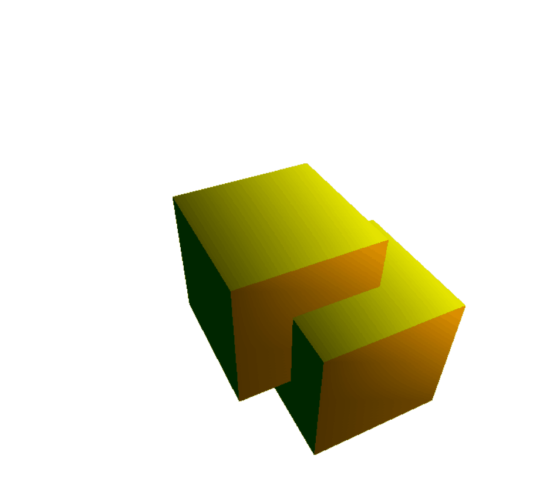

# Custom Render

**Description:**  
A **C# (WinForms)** project created to study the fundamentals of **computer graphics and 3D rendering**.  
Implements the basic stages of building a simple software renderer.

---

## Features

1. **Mesh Rendering** — draws 3D models based on vertices and faces.  
2. **Normal Visualization** — displays surface normals for debugging and analysis.  
3. **Shaded Object Filling** — applies simple lighting to simulate surface illumination.

---

## Tech Stack

- **Language:** C#  
- **Framework:** WinForms  
- **Project Type:** Desktop Application

---

## Project Goal

To explore and understand core 3D graphics concepts such as:
- mesh construction and vertex transformations,  
- 3D to 2D projection techniques,  
- basic lighting and shading models without external graphics engines.

---

## Visualization

---
